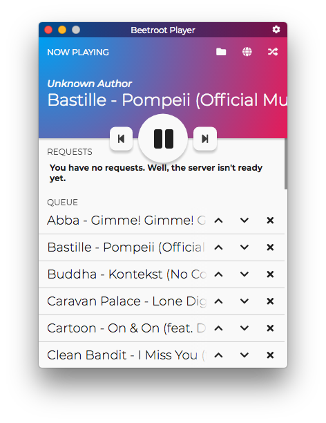

# Beetroot Player

> The refactoring branch contains code that is in the middle of being rewritten
> and my not work at all.
>
> Long story short, over the year of working on this project. The codebase got
> stale and I'm trying to clean it up in a way that is acceptable to my 
> standards (as of August 2019)
>
> The main target of this refactoring are all the files in the
> [scripts](app/scripts) folder and to make them as separate as possible, with
> the only one linking all of them together being a singular UI script.

Beetroot Player is a "boombox" sort-of software which allows you and the
members of your group to queue and play music.

Right now, it's only a crappy music player, but I will eventually make it so
the user's guests can requests songs. But that will be done half-way through
the implementation of [the web service][beetroot-server].

## Screenshot



## Getting Beetroot Player

Beetroot Player is not yet available for a public binary release. You should
build it and retrieve the binaries from
`out/Beetroot Player-{{platform}}-x64/`.

## Building

The build **Beetroot Player**, you will need [Node.js] and [Git].

```bash
# Download from GitHub
git clone https://github.com/thegreatrazz/beetroot-player.git
cd beetroot-player

# Install dependencies, run and debug
npm install
npm start
npm run-script debug        # Open DevTools

# Build it for release
npm run-script make
```

[beetroot-server]: https://github.com/thegreatrazz/beetroot-server
[Node.js]: https://nodejs.org/
[Git]: https://git-scm.com/
